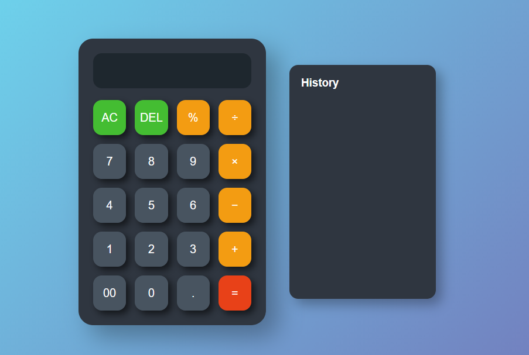
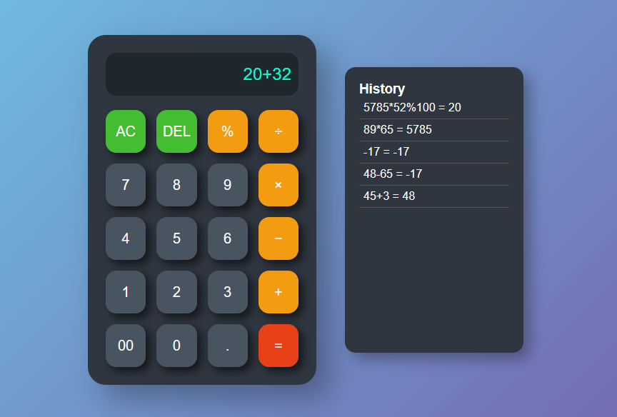
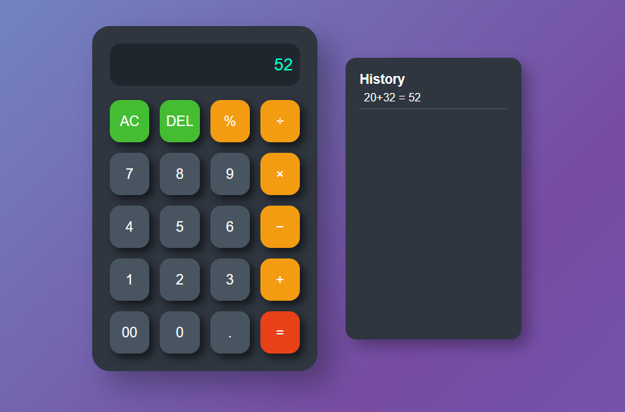

# 🧮 Calculator Web App

🔗 **Live Demo:** https://khush81699.github.io/Calculator/

A simple and responsive **Calculator Web Application** built using **HTML, CSS, and JavaScript**.
This project performs basic arithmetic operations and demonstrates **DOM manipulation, event handling, and frontend logic building using JavaScript**.

---

## 📸 Project Preview





---

## 📖 Project Overview

The Calculator Web App allows users to perform basic mathematical calculations through an **interactive and user-friendly interface**.

Users can input numbers and operators using calculator buttons, and the result is calculated instantly using **JavaScript logic**.

This project helps in understanding:

* 🌐 Frontend project structure
* 🧠 DOM manipulation using JavaScript
* ⚡ Handling user interaction with events
* ➗ Implementing arithmetic logic

---

## 🚀 Features

* ➕ Addition
* ➖ Subtraction
* ✖ Multiplication
* ➗ Division
* 📊 Percentage calculations
* 🧹 AC (All Clear) button
* ⌫ DEL (Delete last value) button
* 📜 Calculation history panel
* ⚡ Instant result display
* ❌ Error handling for invalid expressions
* 🎨 Clean and responsive user interface

---

## 🛠 Technologies Used

* 🌐 **HTML5** – Structure of the application
* 🎨 **CSS3** – Styling and layout design
* ⚡ **JavaScript (Vanilla JS)** – Calculator logic and DOM manipulation
* 🗄 **MySQL** – Example database script for storing calculation history
* 🔧 **Git & GitHub** – Version control and project hosting

---

## 📂 Project Structure

```
Calculator/
│
├── index.html        # Main calculator interface
├── style.css         # Styling and UI design
├── script.js         # Calculator logic and functions
├── calculator.sql    # Example MySQL database script
└── README.md         # Project documentation
```

---

## 💡 How It Works

1️⃣ The user clicks numbers and operators on the calculator interface.

2️⃣ The selected values appear on the calculator display.

3️⃣ JavaScript functions handle:

* Appending numbers and operators
* Clearing the display
* Deleting the last entered value
* Calculating the final result

4️⃣ The calculated result is displayed instantly on the screen.

5️⃣ The **history panel stores previously performed calculations**.

Error handling ensures invalid expressions do not break the application.

---

## ▶️ How to Run the Project

1️⃣ Download or clone the repository

```
git clone https://github.com/Khush81699/Calculator.git
```

2️⃣ Open the project folder

3️⃣ Open `index.html` in your browser

OR

Run using **Live Server in VS Code** for better development experience.

---

## 🗄 Database Script

The project includes a **MySQL script (`calculator.sql`)** which demonstrates how calculation history could be stored in a database for future backend integration.

Example table structure:

| id | expression | result | created_at |
| -- | ---------- | ------ | ---------- |
| 1  | 5 + 3      | 8      | timestamp  |
| 2  | 10 × 4     | 40     | timestamp  |

---

## 📚 What I Learned

Through this project I learned:

* 📂 Structuring a frontend web project
* 🧠 DOM manipulation using JavaScript
* ⚡ Handling user interaction with event listeners
* ➗ Implementing arithmetic logic
* ❌ Error handling in JavaScript
* 🔧 Using Git and GitHub for version control
* 🚀 Deploying projects using **GitHub Pages**
* 🗄 Understanding how frontend projects can connect to databases like **MySQL**

---

## 📌 Future Improvements

* ⌨ Add keyboard input support
* 🧮 Add scientific calculator functions
* 🎨 Improve UI design and animations
* 📜 Add advanced calculation history panel
* 🔗 Connect with backend and MySQL database

---

## 👩‍💻 Author

**Khushboo Gupta**
🚀 Aspiring Software Developer

Currently learning:

* ☕ Core Java
* 🗄 MySQL
* 🌐 Web Development
* 🔧 Git & GitHub

📧 Email: [khushboosgupta864@gmail.com](mailto:khushboosgupta864@gmail.com)

---

⭐ If you like this project, consider giving it a **star on GitHub**.
